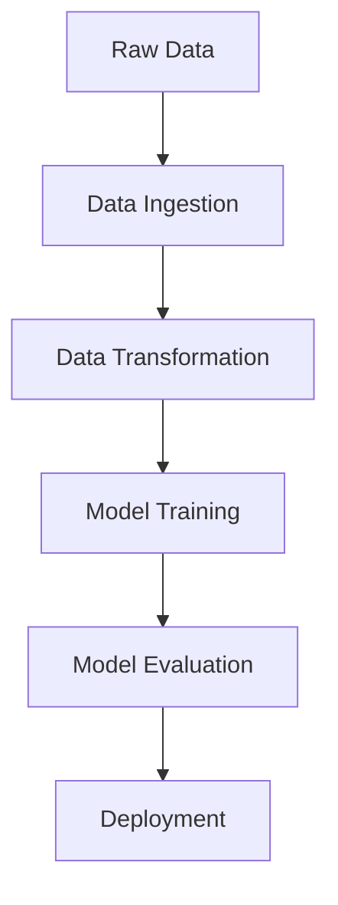

# SensorFaultDetection_1
1 Project of series of 100 end to end ml project Mastery Series.

# Sensor Fault Detection


## Overview
Sensor Fault Detection is an end-to-end machine learning application designed to detect faults in industrial sensors using structured data. The application leverages modular architecture, automated pipelines, and Flask for API integration, ensuring scalability and robustness.

## Features
- **Data Ingestion**: Automated loading and preprocessing of raw sensor data.
- **Data Transformation**: Feature engineering and transformation.
- **Model Training**: Training ML models for accurate fault detection.
- **API Integration**: Flask-based REST API for real-time predictions.
- **Deployment**: Containerized using Docker for seamless deployment.

---

## Table of Contents
- [Overview](#overview)
- [Features](#features)
- [Tech Stack](#tech-stack)
- [Setup Instructions](#setup-instructions)
- [Deployment Guide](#deployment-guide)
- [How to Run the Model](#how-to-run-the-model)
- [Contact Information](#contact-information)

---

## Tech Stack

| Tool | Purpose |
|------|---------|
| **Python** | Core programming language |
| **Pandas & NumPy** | Data processing |
| **Scikit-learn** | Model training |
| **Flask** | API development |
| **Docker** | Containerization |
| **AWS S3** | Data storage |
| **GitHub Actions** | CI/CD pipelines |

---

## Setup Instructions

1. **Clone the Repository:**
   ```bash
   git clone https://github.com/GovindKV/SensorFaultDetection_1.git
   cd SensorFaultDetection_1
   ```

2. **Create a Virtual Environment:**
   ```bash
   python -m venv venv
   source venv/bin/activate  # On Windows: venv\Scripts\activate
   ```

3. **Install Dependencies:**
   ```bash
   pip install -r requirements.txt
   ```

4. **Prepare the Environment:**
   - Ensure the `data/source_data.csv` file exists.
   - Update `config/configurations.py` with appropriate paths.

---

## Deployment Guide

1. **Docker Build and Run:**
   ```bash
   docker build -t sensor-fault-detection .
   docker run -p 5000:5000 sensor-fault-detection
   ```

2. **Cloud Deployment:**
   - Use AWS Elastic Beanstalk or Azure App Services to deploy the Flask application.
   - Push the Docker image to a container registry (e.g., Docker Hub or AWS ECR).

---

## How to Run the Model

1. **Start the Application:**
   ```bash
   python app.py
   ```

2. **Access Endpoints:**
   - **Home Page:** `http://127.0.0.1:5000/`
   - **Training Pipeline:** `http://127.0.0.1:5000/train`
   - **Prediction Pipeline:** `http://127.0.0.1:5000/predict`

3. **Prediction Steps:**
   - Use the `/predict` endpoint to upload a file for predictions.
   - Example using `curl`:
     ```bash
     curl -X POST -F 'file=@path_to_your_file.csv' http://127.0.0.1:5000/predict
     ```

---

## Visual Overview

### Data Pipeline


### Key Tools
- 
- 
- 
- 

---

## Contact Information

- **Gmail**: [Govind26663355@gmail.com](mailto:Govind26663355@gmail.com)
- **LinkedIn**: [https://www.linkedin.com/in/govind-kv/](https://www.linkedin.com/in/govind-kv/)
- **Portfolio**: [https://govindkv.github.io/](https://govindkv.github.io/)

---

Feel free to contribute or suggest improvements by raising issues on the [GitHub Repository](https://github.com/GovindKV/SensorFaultDetection_1).

---

### License
This project is licensed under the MIT License. See the LICENSE file for details.


